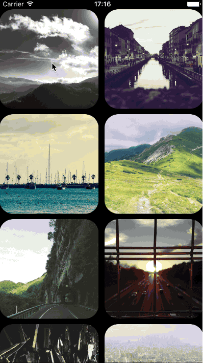
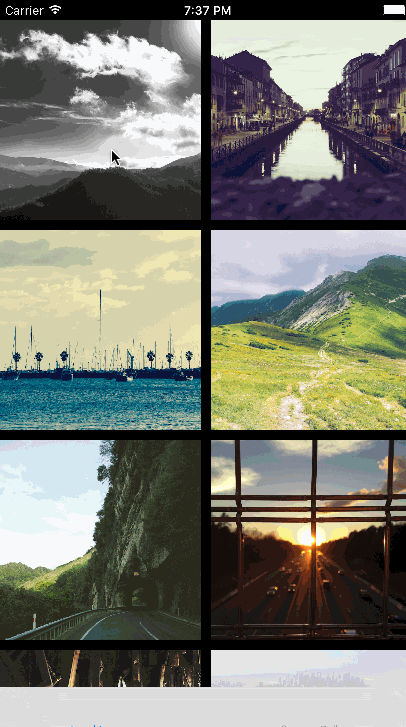
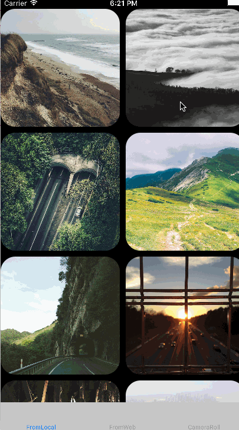

<h1 align="center">SKPhotoBrowser</h1>
<!-- ALL-CONTRIBUTORS-BADGE:START - Do not remove or modify this section -->
[](#contributors-)
<!-- ALL-CONTRIBUTORS-BADGE:END -->
<H4 align="center">
Simple PhotoBrowser/Viewer inspired by facebook, twitter photo browsers written by swift
</H4>

<p align="center">
<a href="https://developer.apple.com/swift">

</a>
<a href="http://cocoadocs.org/docsets/SKPhotoBrowser">

</a>
<a href="https://github.com/Carthage/Carthage">

</a>
<a href="https://developer.apple.com/swift/">
</a>
<a href="">
</a>
</p>


## features
- Display one or more images by providing either `UIImage` objects, or string of URL array.
- Photos can be zoomed and panned, and optional captions can be displayed
        - Minimalistic Facebook-like interface, swipe up/down to dismiss
- Ability to custom control. (hide/ show toolbar for controls, / swipe control)
        - Handling and caching photos from web 
        - Landscape handling
        - Delete photo support(by offbye). By set displayDelete=true show a delete icon in statusbar, deleted indexes can be obtain from delegate func didDeleted 

| Table/CollectionView sample | Button tap sample | gif sample | 
| ------------- | --------------- | --------------|
|  |  | 

## Requirements
        - iOS 9.0+
        - Swift 2.0+
        - ARC

### Version vs Swift version.

        Below is a table that shows which version of SKPhotoBrowser you should use for your Swift version.

| Swift version | SKPhotoBrowser version |
| ------------- | ---------------|
| 5.0           | >= 6.1.0 |
| 4.2           | >= 6.0.0 |
| 4.1           | >= 5.0.0 |
| 3.2           | >= 4.0.0 |
| 2.3           | 2.0.4 - 3.1.4 |
| 2.2           | <= 2.0.3 |

## Installation

#### CocoaPods
available on CocoaPods. Just add the following to your project Podfile:
```
pod 'SKPhotoBrowser'
use_frameworks!
```

#### Carthage
To integrate into your Xcode project using Carthage, specify it in your Cartfile:

```ogdl
github "suzuki-0000/SKPhotoBrowser"
```

#### Info.plist
If you want to use share image feature, it includes save image into galery, so you should specify a permission into your Info.plist (if you haven't done it yet).

```
<key>NSPhotoLibraryAddUsageDescription</key>
<string>Used to save images into your galery</string>
```

#### Swift Package Manager
Available in Swift Package Manager. Use the repository URL in Xcode

## Usage
See the code snippet below for an example of how to implement, or see the example project.
	
from UIImages:
```swift
// 1. create SKPhoto Array from UIImage
var images = [SKPhoto]()
let photo = SKPhoto.photoWithImage(UIImage())// add some UIImage
images.append(photo) 

// 2. create PhotoBrowser Instance, and present from your viewController. 
let browser = SKPhotoBrowser(photos: images)
browser.initializePageIndex(0)
present(browser, animated: true, completion: {})
```

from URLs:
```swift
// 1. create URL Array 
var images = [SKPhoto]()
let photo = SKPhoto.photoWithImageURL("https://placehold.jp/150x150.png")
photo.shouldCachePhotoURLImage = false // you can use image cache by true(NSCache)
images.append(photo)

// 2. create PhotoBrowser Instance, and present. 
let browser = SKPhotoBrowser(photos: images)
browser.initializePageIndex(0)
present(browser, animated: true, completion: {})
```

from local files:
```swift
// 1. create images from local files
var images = [SKLocalPhoto]()
let photo = SKLocalPhoto.photoWithImageURL("..some_local_path/150x150.png")
images.append(photo)

// 2. create PhotoBrowser Instance, and present. 
let browser = SKPhotoBrowser(photos: images)
browser.initializePageIndex(0)
present(browser, animated: true, completion: {})
```

If you want to use zooming effect from an existing view, use another initializer:
```swift
// e.g.: some tableView or collectionView.
func collectionView(collectionView: UICollectionView, didSelectItemAtIndexPath indexPath: NSIndexPath) {
   let cell = collectionView.cellForItemAtIndexPath(indexPath) 
   let originImage = cell.exampleImageView.image // some image for baseImage 

   let browser = SKPhotoBrowser(originImage: originImage ?? UIImage(), photos: images, animatedFromView: cell) 
   browser.initializePageIndex(indexPath.row)
   present(browser, animated: true, completion: {})
}
```

### Custom

#### Toolbar
You can customize Toolbar via SKPhotoBrowserOptions.

```swift
SKPhotoBrowserOptions.displayToolbar = false                              // all tool bar will be hidden
SKPhotoBrowserOptions.displayCounterLabel = false                         // counter label will be hidden
SKPhotoBrowserOptions.displayBackAndForwardButton = false                 // back / forward button will be hidden
SKPhotoBrowserOptions.displayAction = false                               // action button will be hidden
SKPhotoBrowserOptions.displayHorizontalScrollIndicator = false            // horizontal scroll bar will be hidden
SKPhotoBrowserOptions.displayVerticalScrollIndicator = false              // vertical scroll bar will be hidden
let browser = SKPhotoBrowser(originImage: originImage, photos: images, animatedFromView: cell)
```

#### Colors
You can customize text, icon and background colors via SKPhotoBrowserOptions or SKToolbarOptions
```swift
SKPhotoBrowserOptions.backgroundColor = UIColor.whiteColor()               // browser view will be white
SKPhotoBrowserOptions.textAndIconColor = UIColor.blackColor()              // text and icons will be black
SKToolbarOptions.textShadowColor = UIColor.clearColor()                    // shadow of toolbar text will be removed
SKToolbarOptions.font = UIFont(name: "Futura", size: 16.0)                 // font of toolbar will be 'Futura'
```

#### Images
You can customize the padding of displayed images via SKPhotoBrowserOptions
```swift
SKPhotoBrowserOptions.imagePaddingX = 50                                   // image padding left and right will be 25
SKPhotoBrowserOptions.imagePaddingY = 50                                   // image padding top and bottom will be 25
```

#### Statusbar
You can customize the visibility of the Statusbar in browser view via SKPhotoBrowserOptions
```swift
SKPhotoBrowserOptions.displayStatusbar = false                             // status bar will be hidden
```

#### Close And Delete Buttons
That how you can customize close and delete buttons
```
SKPhotoBrowserOptions.displayDeleteButton = true                           // delete button will be shown
SKPhotoBrowserOptions.swapCloseAndDeleteButtons = true                     // now close button located on right side of screen and delete button is on left side
SKPhotoBrowserOptions.closeAndDeleteButtonPadding = 20                     // set offset from top and from nearest screen edge of close button and delete button
```

#### Custom Cache From Web URL
You can use SKCacheable protocol if others are adaptable. (SKImageCacheable or SKRequestResponseCacheable)

```swift
e.g. SDWebImage

// 1. create custom cache, implement in accordance with the protocol 
class CustomImageCache: SKImageCacheable { var cache: SDImageCache }

// 2. replace SKCache instance with custom cache
SKCache.sharedCache.imageCache = CustomImageCache()
```

#### CustomButton Image
Close, Delete buttons are able to change image and frame.
``` swift
browser.updateCloseButton(UIImage())
browser.updateUpdateButton(UIImage())
```

#### Delete Photo
You can delete your photo for your own handling. detect button tap from `removePhoto` delegate function.


#### Photo Captions
Photo captions can be displayed simply bottom of PhotoBrowser. by setting the `caption` property on specific photos:
``` swift
let photo = SKPhoto.photoWithImage(UIImage())
photo.caption = "Lorem Ipsum is simply dummy text of the printing and typesetting industry."
```

#### SwipeGesture 
vertical swipe can enable/disable:
``` swift
SKPhotoBrowserOptions.disableVerticalSwipe = true 
``` 

#### Delegate
There's some trigger point you can handle using delegate. those are optional.
See [SKPhotoBrowserDelegate](https://github.com/suzuki-0000/SKPhotoBrowser/blob/master/SKPhotoBrowser/SKPhotoBrowserDelegate.swift) for more details.
- didShowPhotoAtIndex(_ index:Int) 
- willDismissAtPageIndex(_ index:Int)
- willShowActionSheet(_ photoIndex: Int)
- didDismissAtPageIndex(_ index:Int)
- didDismissActionSheetWithButtonIndex(_ buttonIndex: Int, photoIndex: Int)
- didScrollToIndex(_ index: Int)
- removePhoto(_ browser: SKPhotoBrowser, index: Int, reload: (() -> Void))
- viewForPhoto(_ browser: SKPhotoBrowser, index: Int) -> UIView?
- controlsVisibilityToggled(_ browser: SKPhotoBrowser, hidden: Bool)

```swift
let browser = SKPhotoBrowser(originImage: originImage, photos: images, animatedFromView: cell)
browser.delegate = self

// MARK: - SKPhotoBrowserDelegate
func didShowPhotoAtIndex(_ index: Int) {
// when photo will be shown
}

func willDismissAtPageIndex(_ index: Int) {
// when PhotoBrowser will be dismissed
}

func didDismissAtPageIndex(_ index: Int) {
// when PhotoBrowser did dismissed
}

```

#### Options
You can access via `SKPhotoBrowserOptions`, which can use for browser control.
See [SKPhotoBrowserOptions](https://github.com/suzuki-0000/SKPhotoBrowser/blob/master/SKPhotoBrowser/SKPhotoBrowserOptions.swift) for more details.
- single tap handling, dismiss/noaction
- blackArea handling which is appearing outside of photo
- bounce animation when appearing/dismissing
- text color, font, or more
``` swift
SKPhotoBrowserOptions.enableZoomBlackArea    = true  // default true
SKPhotoBrowserOptions.enableSingleTapDismiss = true  // default false
``` 

## Photos from
- [Unsplash](https://unsplash.com)

## License
available under the MIT license. See the LICENSE file for more info.

## Contributors

Thanks goes to these wonderful people ([emoji key](https://github.com/kentcdodds/all-contributors#emoji-key)):
<!-- ALL-CONTRIBUTORS-LIST:START - Do not remove or modify this section -->
<!-- prettier-ignore-start -->
<!-- markdownlint-disable -->
<table>
  <tr>
    <td align="center"><a href="https://p36348.github.io/"><br /><sub><b>Oreo Chen</b></sub></a><br /><a href="https://github.com/suzuki-0000/SKPhotoBrowser/commits?author=p36348" title="Code">💻</a></td>
  </tr>
</table>

<!-- markdownlint-restore -->
<!-- prettier-ignore-end -->

<!-- ALL-CONTRIBUTORS-LIST:END -->

<!-- ALL-CONTRIBUTORS-LIST:START - Do not remove or modify this section -->
<!-- prettier-ignore -->
| [<br /><sub><b>Alexander Khitev</b></sub>](https://github.com/alexanderkhitev)<br />[💻](https://github.com/suzuki-0000/SKPhotoBrowser/commits?author=alexanderkhitev "Code") | [<br /><sub><b>K Rummler</b></sub>](https://github.com/krummler)<br />[💻](https://github.com/suzuki-0000/SKPhotoBrowser/commits?author=krummler "Code") | [<br /><sub><b>Mads Bjerre</b></sub>](http://wisekopf.com)<br />[💻](https://github.com/suzuki-0000/SKPhotoBrowser/commits?author=madsb "Code") | [<br /><sub><b>Meng Ye</b></sub>](https://jk2K.com)<br />[💻](https://github.com/suzuki-0000/SKPhotoBrowser/commits?author=jk2K "Code") | [<br /><sub><b>_ant_one</b></sub>](https://github.com/barrault01)<br />[💻](https://github.com/suzuki-0000/SKPhotoBrowser/commits?author=barrault01 "Code") | [<br /><sub><b>Tim Roesner</b></sub>](http://timroesner.com)<br />[💻](https://github.com/suzuki-0000/SKPhotoBrowser/commits?author=timroesner "Code") | [<br /><sub><b>胥冥</b></sub>](http://www.zxming.com)<br />[💻](https://github.com/suzuki-0000/SKPhotoBrowser/commits?author=zxming "Code") |
| :---: | :---: | :---: | :---: | :---: | :---: | :---: |
| [<br /><sub><b>Kevin Wolkober</b></sub>](http://kevinwo.github.io)<br />[💻](https://github.com/suzuki-0000/SKPhotoBrowser/commits?author=kevinwo "Code") | [<br /><sub><b>PJ Gray</b></sub>](http://www.saygoodnight.com/)<br />[💻](https://github.com/suzuki-0000/SKPhotoBrowser/commits?author=pj4533 "Code") | [<br /><sub><b>ghysrc</b></sub>](https://github.com/ghysrc)<br />[💻](https://github.com/suzuki-0000/SKPhotoBrowser/commits?author=ghysrc "Code") | [<br /><sub><b>Josef Doležal</b></sub>](http://josefdolezal.github.com)<br />[💻](https://github.com/suzuki-0000/SKPhotoBrowser/commits?author=josefdolezal "Code") | [<br /><sub><b>Mark Goody</b></sub>](https://marramgrass.micro.blog/)<br />[💻](https://github.com/suzuki-0000/SKPhotoBrowser/commits?author=marramgrass "Code") | [<br /><sub><b>Philippe Riegert</b></sub>](https://github.com/PhilippeRiegert)<br />[💻](https://github.com/suzuki-0000/SKPhotoBrowser/commits?author=PhilippeRiegert "Code") | [<br /><sub><b>Bryan Irace</b></sub>](http://irace.me)<br />[💻](https://github.com/suzuki-0000/SKPhotoBrowser/commits?author=irace "Code") |
| [<br /><sub><b>dirtmelon</b></sub>](https://github.com/dirtmelon)<br />[💻](https://github.com/suzuki-0000/SKPhotoBrowser/commits?author=dirtmelon "Code") | [<br /><sub><b>Heberti Almeida</b></sub>](https://dribbble.com/hebertialmeida)<br />[💻](https://github.com/suzuki-0000/SKPhotoBrowser/commits?author=hebertialmeida "Code") | [<br /><sub><b>Felix Weiss</b></sub>](http://othellogame.net)<br />[💻](https://github.com/suzuki-0000/SKPhotoBrowser/commits?author=appsunited "Code") | [<br /><sub><b>.Some</b></sub>](https://github.com/BigDanceMouse)<br />[💻](https://github.com/suzuki-0000/SKPhotoBrowser/commits?author=BigDanceMouse "Code") | [<br /><sub><b>Onur Var</b></sub>](https://tr.linkedin.com/in/onur-var)<br />[💻](https://github.com/suzuki-0000/SKPhotoBrowser/commits?author=OnurVar "Code") | [<br /><sub><b>Andrew Barba</b></sub>](https://abarba.me)<br />[💻](https://github.com/suzuki-0000/SKPhotoBrowser/commits?author=AndrewBarba "Code") |
<!-- ALL-CONTRIBUTORS-LIST:END -->

This project follows the [all-contributors](https://github.com/kentcdodds/all-contributors) specification. Contributions of any kind welcome!

